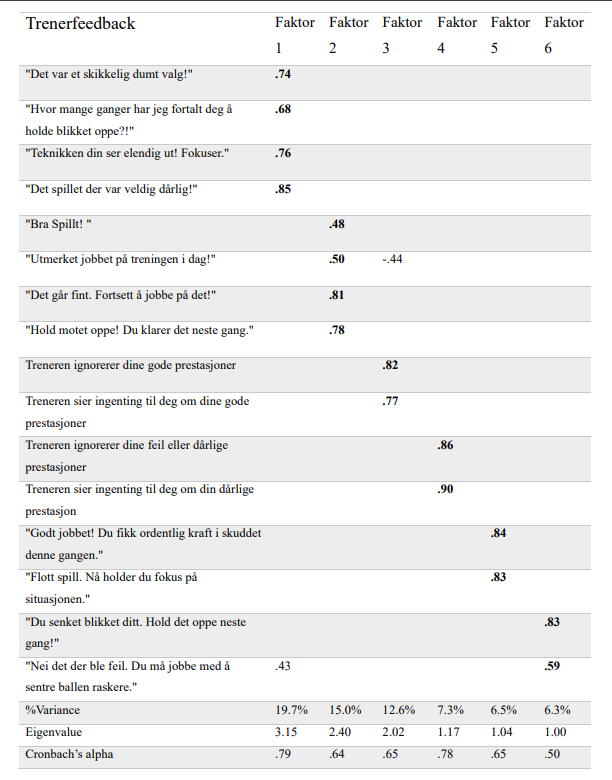
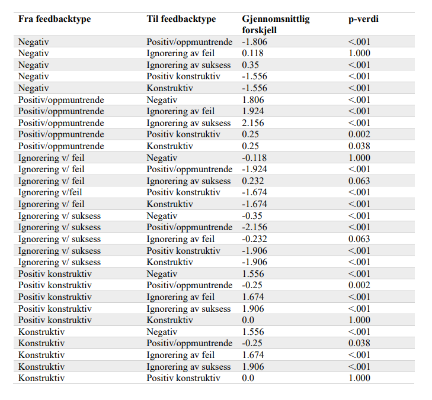
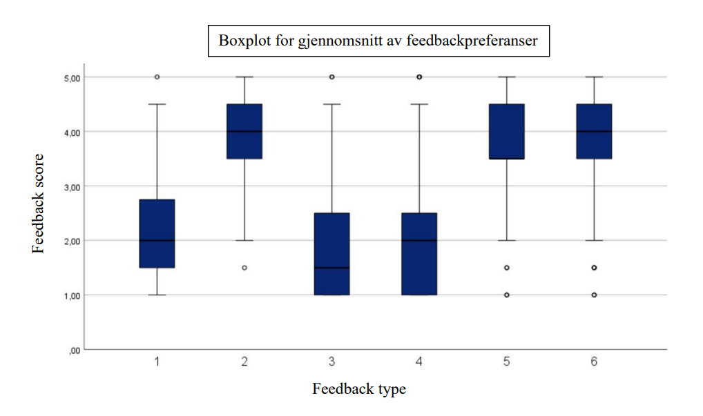
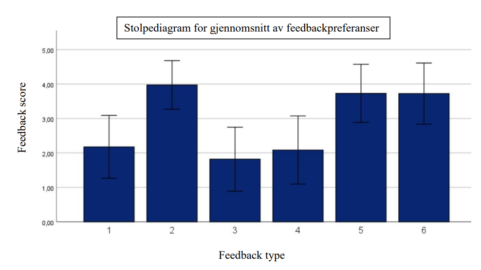

# Football Player Feedback Preferences Analysis

## Project Overview

This project investigates which types of coaching feedback are preferred by male amateur football players competing in the Norwegian 4th–6th divisions.

The study was based on survey responses collected from 197 football players across Norway and aimed to identify which coaching behaviours athletes perceive as most supportive and motivating.

Using statistical analysis, the project explores underlying feedback dimensions and compares player preferences across different coaching styles.

The project demonstrates the application of quantitative research methods and statistical analysis to answer a real-world research question using data collected specifically for this study.

---

# Research Question

**Which forms of coaching feedback are preferred among male amateur football players competing in the Norwegian 4th–6th divisions?**

---

# Objectives

The objectives of this project were to:

- Investigate football players' preferences for different coaching feedback styles.
- Identify underlying feedback dimensions using Exploratory Factor Analysis.
- Compare preferences across different feedback types.
- Examine whether significant differences existed between feedback categories.
- Provide practical recommendations for coaches working in amateur football.

---

# Dataset

- **Source:** Self-collected survey data
- **Participants:** 197 male football players
- **Population:** Norwegian amateur football (4th–6th division)
- **Data collection:** Online questionnaire
- **Questionnaire:** Coaching Feedback Questionnaire (CFQ), adapted and translated into Norwegian

The dataset consists of anonymous survey responses collected specifically for this research project.

---

# Statistical Methods

The project involved several statistical techniques:

- Data Cleaning
- Descriptive Statistics
- Exploratory Factor Analysis (Principal Component Analysis)
- Varimax Rotation
- Cronbach's Alpha
- Repeated Measures ANOVA
- Bonferroni Post Hoc Analysis
- Boxplot Analysis

---

# Factor Analysis

An Exploratory Factor Analysis (Principal Component Analysis with Varimax rotation) identified six underlying coaching feedback dimensions:

- Negative Feedback
- Positive / Encouraging Feedback
- Ignoring Success
- Ignoring Mistakes
- Positive Constructive Feedback
- Constructive Feedback

The six factors explained approximately **67.5%** of the total variance.

---

# Results

The analysis showed statistically significant differences in players' preferences for coaching feedback.

Positive and encouraging feedback received the highest ratings, closely followed by constructive and positive constructive feedback.

Negative feedback and the absence of feedback were rated as the least preferred coaching behaviours.

Repeated Measures ANOVA demonstrated a significant overall difference between feedback types:

- **F(5,955) = 255.97**
- **p < .001**
- **η² = .573**

The results indicate a large effect size, suggesting that coaching feedback style strongly influences athlete preferences.

---

# Visualizations

The project includes visualizations illustrating the findings, including:

- Average feedback preferences
- Boxplots of feedback distributions
- Factor structure
- Statistical comparison of feedback categories

# Box Plot Chart
The boxplots illustrate the distribution of player preferences across the six coaching feedback dimensions. Positive and encouraging feedback received the highest ratings with relatively low variation between participants, indicating broad agreement among players. Negative feedback and the absence of feedback received considerably lower ratings and displayed greater variation, suggesting that these coaching behaviours are generally less preferred. The visualizations provide a clear overview of differences in both median preference scores and response variability across feedback categories.

# Bar Chart
The bar chart presents the average preference score for each coaching feedback dimension.
Positive and encouraging feedback achieved the highest mean score, followed closely by constructive and positive constructive feedback. Negative feedback, along with ignoring player performance, received substantially lower ratings. The results suggest that players strongly prefer supportive and competence-enhancing coaching behaviours over critical or absent feedback.

---

# Key Findings

- Positive and encouraging feedback was the most preferred coaching style.
- Constructive feedback was also highly valued.
- Negative feedback received the lowest preference scores.
- Ignoring player performance (both success and mistakes) was viewed almost as negatively as direct criticism.
- The findings support previous research suggesting that athletes respond best to supportive and competence-enhancing coaching behaviours.

---

# Practical Applications

The findings may help football coaches:

- Improve communication with players.
- Increase athlete motivation.
- Strengthen coach–athlete relationships.
- Support long-term player development.
- Create a more positive learning environment.

---

# Skills Demonstrated

- Research Design
- Survey Development
- Data Collection
- Statistical Analysis
- Exploratory Factor Analysis
- Principal Component Analysis (PCA)
- Repeated Measures ANOVA
- Statistical Interpretation
- Data Visualization
- Scientific Reporting

---

# Tools Used

- IBM SPSS Statistics
- Microsoft Excel
- Microsoft Word

---

# Project Background

This project is based on research conducted as part of my Master's degree in Sports Science.

For portfolio purposes, the study has been adapted into a data analysis case study highlighting the statistical methods, analytical workflow and practical insights generated from the research.

---

# Disclaimer

This project is based on anonymous survey responses collected for academic research.

The raw dataset is not publicly available in order to protect participant confidentiality and comply with research ethics requirements.

The analyses, results and thesis are shared solely for educational and portfolio purposes.
